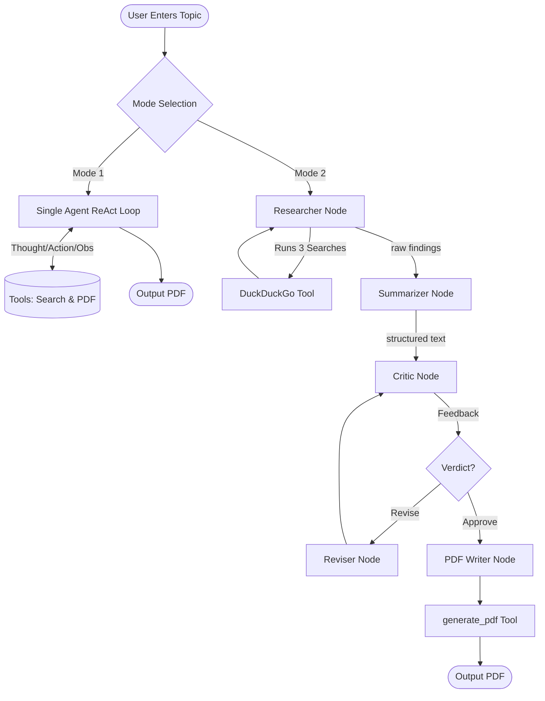
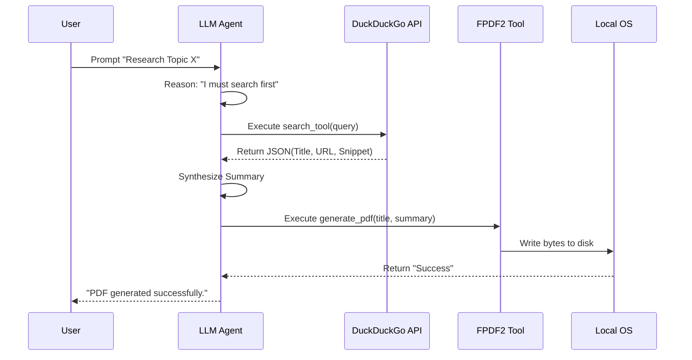

# Agentic AI System: Research Assistant Agent

**Topic Name** - Autonomous Research Assistant using ReAct and Multi-Agent Collaboration

## Introduction & Abstract of Problem Statement
**Problem Statement:** Retrieving, synthesizing, and formatting information from the internet manually is a time-consuming process for researchers and knowledge workers. Standard Large Language Models (LLMs) are limited by their training data cutoff dates and cannot autonomously verify facts using current web data.
**Abstract:** This project implements an Agentic AI Research Assistant capable of autonomously fetching real-time data and synthesizing structured academic summaries. By employing both a single-agent ReAct loop and a multi-agent LangGraph pipeline, the system allows user queries to be iteratively researched via the DuckDuckGo Search API. The finalized synthesis is evaluated for quality and ultimately compiled into a formatted PDF document, bridging the gap between passive LLM generation and active, autonomous knowledge retrieval.

## AI Framework(s) Used
- **LangChain:** Core framework used for wrapping the LLM and providing tool-calling capabilities [[1]](#references).
- **LangGraph:** Used to construct a stateful multi-agent pipeline representing distinct node-based personas (Researcher, Summarizer, Critic, Reviser) connected by conditional logic [[2]](#references).

## Tools Integrated with Agent
1. **DuckDuckGo Search (`ddgs`):** Real-time web search tool used to scrape up-to-date internet findings [[3]](#references).
2. **Custom PDF Generator (`fpdf2`):** Python-based layout tool to autonomously convert markdown text into a properly formatted, downloadable PDF document.

---

## Part A – Agent Design (Modern View)

### Goal of the Agent
The primary goal is to receive a natural-language query about any topic, autonomously search the internet for relevant and current information, synthesize those findings into a clear four-part summary, and output a formatted PDF report without requiring human intervention mid-process.

### Agent Role
The agent acts as an **autonomous knowledge worker**. Instead of merely generating text from its pre-training data, it actively researches current information, parses search results, checks its own output for quality, and utilizes a document creation tool to deliver the final product.

### Tools Used
- **Web Search Tool:** To fetch live data.
- **Generate PDF Tool:** To execute the final physical write operation to the local file system.

### Memory Type (Short-term / Context)
The agents utilize **Short-term Working Memory (Context Window)**. During an execution trace, the agent remembers the original goal, the observations retrieved from the search tool, and its own previous "Thoughts" and "Actions". The state dictionary (`ResearchState`) is passed across nodes during the session. Once the PDF is generated, this episodic memory is cleared.

### Planning Strategy (ReAct / Step-by-step)
The system employs the **ReAct (Reason + Act)** prompting strategy in Mode 1, and a **StateGraph Directed Acyclic Graph (DAG)** in Mode 2. 
- **Thought:** The LLM analyzes the current state and decides what to do next.
- **Action:** The LLM selects a specific tool and provides the necessary input parameters.
- **Observation:** The tool executes and returns the result back to the LLM.

---

## Part B – Implementation (Modern AI Tools)

### LLM-Based Agent
**LLM Used:** Google `gemini-2.5-flash` (via `langchain-google-genai`).
**Justification:** Gemini 2.5 Flash was chosen due to its exceptionally fast inference times, large context window (capable of ingesting massive amounts of search results), and excellent native tool-calling capabilities. Furthermore, it is available via Google AI Studio, making it highly accessible for rapid prototyping without heavy API costs [[4]](#references).

### Tools Used
1. **Search Tool (`DuckDuckGo Search API`):** 
   - **Justification:** Chosen because it provides free, rate-limit friendly access to current web data without requiring complex web-scraping setups or paid API keys (like SerpAPI).
   - **Features:** Configured to pull titles, URLs, and text snippets. 
2. **PDF Tool (`fpdf2`):**
   - **Justification:** Chosen because it allows programmatic control over document layout. 
   - **Features:** Handles custom Markdown parsing, rendering H1/H2/H3 headers, bullet points, and Unicode-to-Latin1 safe character mapping.

### Multi-Step Reasoning
The multi-agent pipeline explicitly divides reasoning into four phases:
1. **Researcher:** Plans 3 orthogonal search queries based on the topic.
2. **Summarizer:** Reads the raw data and plans a 4-section academic paper.
3. **Critic:** Evaluates the paper against strict logic rules.
4. **Reviser:** (Conditional) Improves the paper if the Critic flagged issues.

### Architecture Diagram

*(You can copy/paste this Mermaid diagram into any Markdown renderer or diagram generator like excalidraw)*

### Tool Flow Diagram

### Observable Agent Behavior (Logs / Traces)
A full system logger was implemented (`AgentLogger`) which hooks into `sys.stdout`. It intercepts both the ReAct reasoning loops and the LangGraph transitions and saves them to a file (e.g. `agent_log_super_natural_powers_in_india_20260402_152138.txt`). 
*(Note: Attach screenshots of the terminal trace or the log file in your final submission).*

### Code Repository
*(Note: Link your GitHub repository here or state that code files `app.py` and `multi_agent.py` are attached).*

### Prompts & Output Screenshots
**Researcher Prompt:**
> You are a research specialist. Generate exactly 3 targeted search queries for the topic: "{topic}". Return ONLY the 3 queries, one per line. No numbering, no explanation.

**Summarizer Prompt:**
> You are an expert academic summarizer. Your task is to transform raw web search results into a clear, structured, and thorough research summary. Structure your output with these sections: Overview, Key Findings / Advancements, Applications & Implications, Conclusion.

**Critic Prompt:**
> You are a strict quality-control expert for research reports. Evaluate the given summary and respond in exactly this format: VERDICT: approve OR VERDICT: revise. FEEDBACK: [specific actionable feedback].

*(Note: Paste screenshots of the terminal output and the final PDF report here).*

---

## Screen Recording Link
*(Note: Insert the Google Drive / YouTube link for your demo recording here)*
[Link to Video Demonstration]

---

## Discussion & Takeaway
**Discussion:** Building an agentic system highlighted the massive leap from simple "chatbots" to action-oriented agents. The most significant challenge was standardizing the data between the LLM and the tools (e.g., handling Unicode characters for the PDF, and ensuring the LLM reliably outputted the correct arguments for the tools). The LangGraph implementation was particularly insightful because it showed how restricting an LLM's scope (a Critic vs a Summarizer) drastically improves output quality compared to forcing one agent to do everything.
**Takeaway:** Agentic workflows (especially multi-agent graphs) represent the future of automation. By combining search connectivity with generative synthesis, we can compress hours of manual research into seconds.

---

## Conclusion
The developed Agentic AI Research Assistant successfully bridges the gap between static LLM knowledge and real-time execution. By integrating Gemini 2.5 Flash with search and document genesis tools within a LangGraph architecture, the system proves capable of autonomous problem solving. This activity demonstrated the power of the ReAct methodology and the necessity of robust error handling and tool design in modern AI systems.

---

## References
1. LangChain Platform Documentation: <https://python.langchain.com/>
2. LangGraph Documentation: <https://langchain-ai.github.io/langgraph/>
3. DuckDuckGo Search Package: <https://pypi.org/project/duckduckgo-search/>
4. Google AI Studio (Gemini 2.5): <https://aistudio.google.com/>
